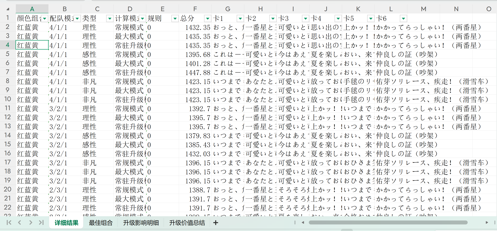
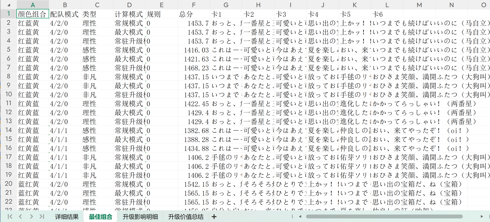
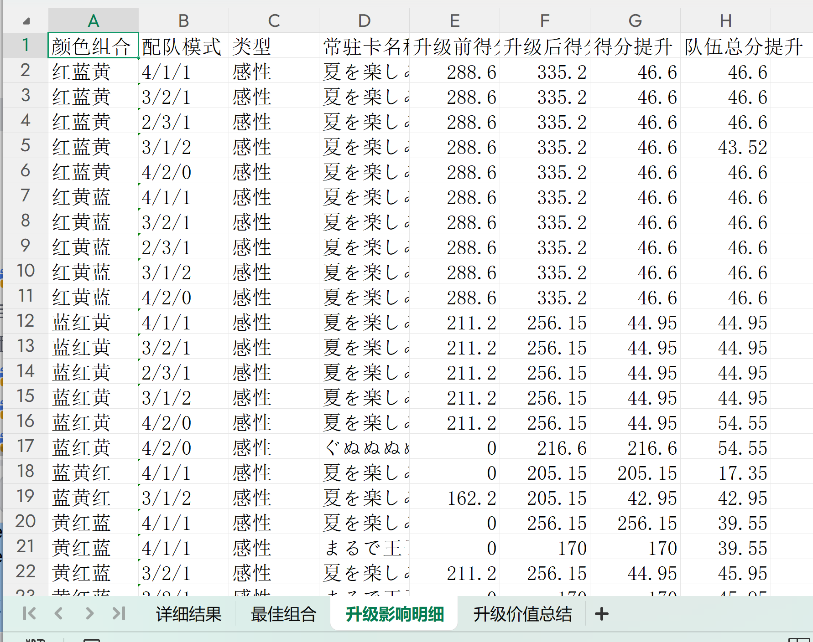
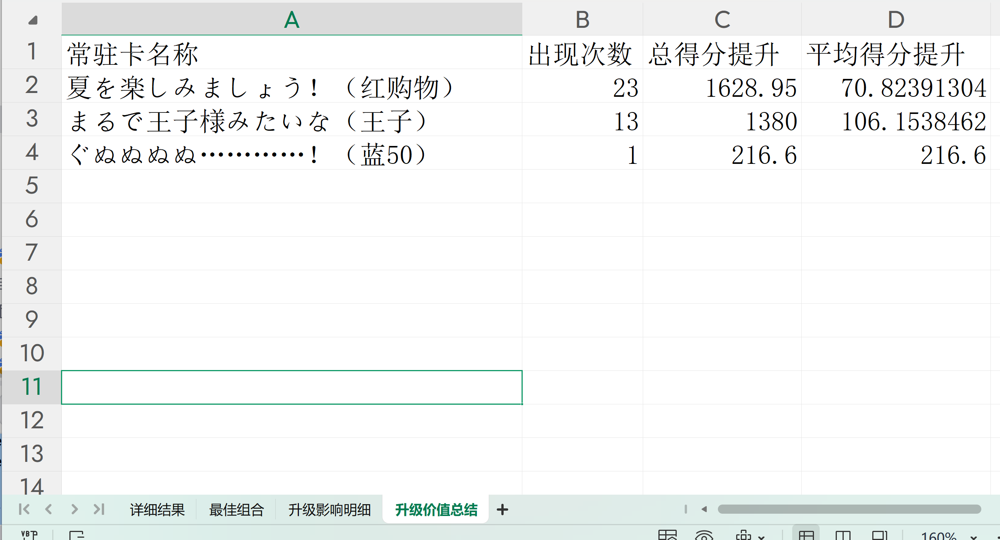

# 学园偶像大师 - 自动支援卡卡组计算

本项目用于基于现有支援卡状态，计算在当前等级最优卡组，升到当前上限等级最优卡组，和常驻支援卡兑换升5级上限的最优卡组

同时提供打分建议，A对应第五次SP二属性，B对应第四次SP二属性，C对应第三四次SP二属性，同时给出预估的成功率（所有SP都按预期出现的概率）

同时提供基于现有卡组兑换哪个常驻支援卡可以获得提升


---

## 运行

使用：运行python程序或直接运行exe程序（如果没有python环境），需要四个xlsx文件在同一目录下

    python cal_card.py 
或

    cal_card.exe
运行后会依次计算每一种颜色组合的最优卡组

(.venv) D:\Program\SImas1\Upload>cal_card.exe
```bash
开始批量优化计算...
正在预加载卡牌数据和计算规则...
预加载完成，开始批量计算...
已加载 26 个角色状态组合。

已导出到 Excel: 基础选卡.xlsx
  Sheet 1 - 详细结果: 2340 行
  Sheet 2 - 最佳组合: 234 行
  Sheet 3 - 升级影响明细: 349 行
  Sheet 4 - 升级价值总结: 5 行

计算完成，共生成 2340 行数据。
按下回车键后退出
```
最终生成的表格中，工作表1是全部组合得分的详细结果；工作表2是结合不同配队的最优卡组

工作表3和工作表4则是用来判断以当前卡组如果兑换一张常驻卡升5级上限能否给卡组带来提升




