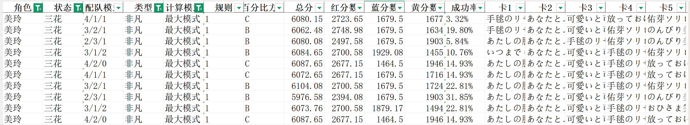

# 学园偶像大师 - 自动支援卡卡组计算

本项目用于基于现有支援卡状态，计算在当前等级最优卡组，升到当前上限等级最优卡组，和常驻支援卡兑换升5级上限的最优卡组

同时提供基于现有卡组兑换哪个常驻支援卡可以获得提升

---

## 运行

使用：运行python程序或直接运行exe程序（如果没有python环境），需要三个xlsx文件在同一目录下

    python cal_card.py 
或

    cal_card.exe
运行后会依次计算每一种颜色组合的最优卡组

(.venv) D:\Program\SImas1\Upload>cal_card.exe
```bash
开始批量优化计算...
正在进行红,蓝,黄组合的计算，进度0/6
正在进行红,黄,蓝组合的计算，进度1/6
正在进行蓝,红,黄组合的计算，进度2/6
正在进行蓝,黄,红组合的计算，进度3/6
正在进行黄,红,蓝组合的计算，进度4/6
正在进行黄,蓝,红组合的计算，进度5/6
已导出到 Excel: 基础选卡.xlsx
  Sheet 1 - 详细结果: 270 行
  Sheet 2 - 最佳组合: 54 行
  Sheet 3 - 升级影响明细: 37 行
  Sheet 4 - 升级价值总结: 3 行

计算完成，共生成 270 行数据。
按回车键退出程序...
```
最终生成的表格中，工作表1是全部组合得分的详细结果；工作表2是结合不同配队的最优卡组

工作表3和工作表4则是用来判断以当前卡组如果兑换一张常驻卡升5级上限能否给卡组带来提升



